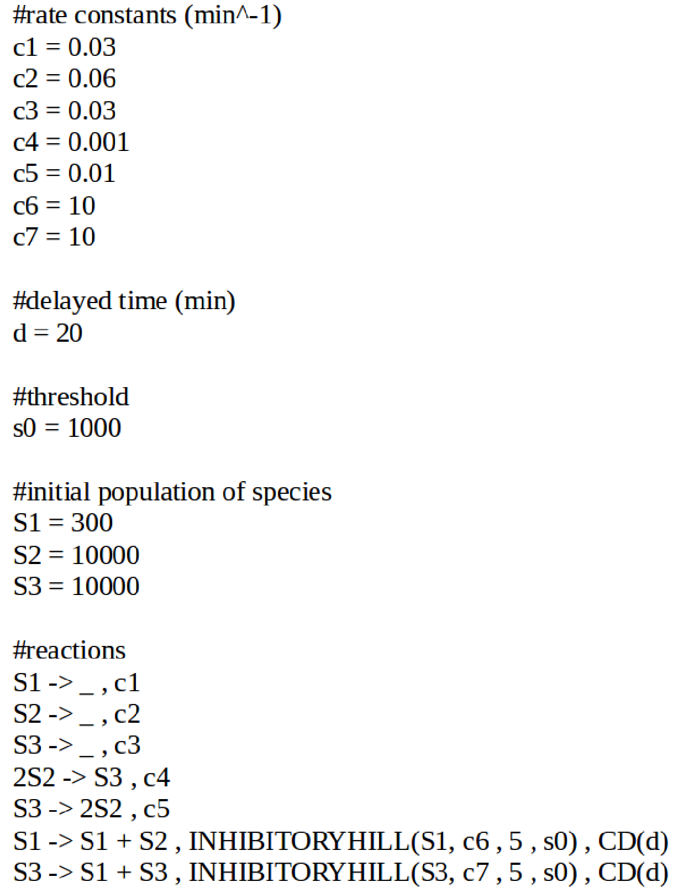
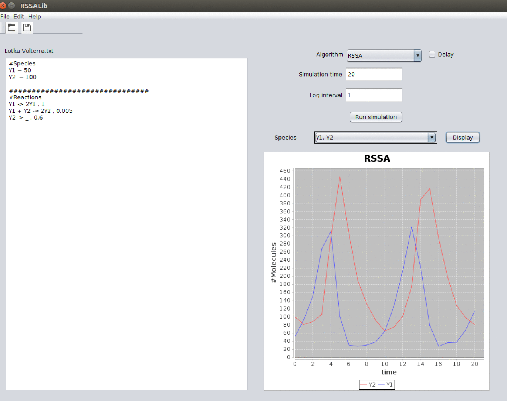
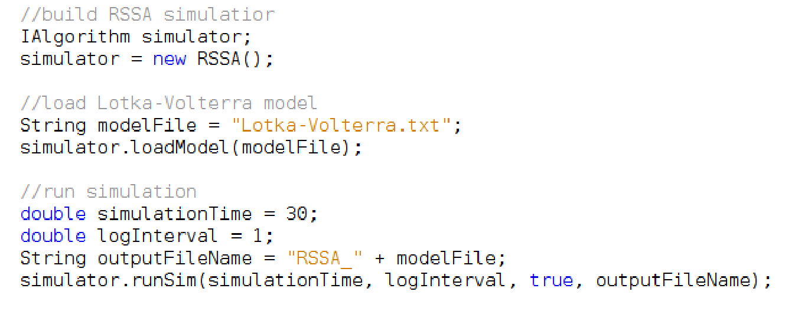

# RSSALib
The Java-based implementation of the rejection-based stochastic simulation algorithm (RSSA) and a wide range of its improvements to accelerate the simulation and analysis of biochemical reactions. The simulation library supports reactions with complex kinetics and time delays, necessary to model complexities of reaction mechanisms. RSSALib provides both an application program interface (API) and a graphic user interface (GUI) to ease the set-up and visualization of the simulation results. 

## 1) Background
RSSA is an exact simulation [1] that accelerates simulation performance by reducing the average computations of reaction propensities. It is specifically tailored for reaction networks in which reaction propensities are time-consuming (e.g.,Michaelis-Menten kinetics, Hill kinetics) and delay-dependent. During the simulation of RSSA, many propensity updates are completely avoided. For doing that, RSSA abstracts the propensity of a reaction with an interval including all possible concrete propensity values. The propensity bounds of reactions are derived by specifying an arbitrary bound on the population of each species (the choice of which affects the performance, but not the exactness of the results). A detailed analysis of the choice of population bound is dicussed in [2]. RSSA uses these propensity bounds to select the next reaction firing in two steps. First, a candidate reaction is randomly chosen proportionally to its propensity upper bound. The selected candidate is then inspected through a rejection test to ensure that it fires with the same probability determined by SSA. The validation step postpones the evaluation of the exact propensity of the candidate reaction by exploiting its propensity lower bound. The exact propensity will be evaluated only if needed. The candidate reaction is either fired or (with low probability) rejected. If it is accepted to fire, only the state is updated, without recomputing the propensity except in uncommon cases. New propensity bounds are recomputed only when the population of a species exits the chosen bound. In case of rejection, a new candidate reaction is selected. 

## 2) Implementations and improvements
RSSALib provides a full implementation of all known RSSA formulations to offer their computational advantages in dealing with varying complexities of biological networks. Specifically, it implements:

* RSSA: an implementation of the original algorithm. Our implementation further improves the search of the next reaction by reusing the previously computed sum of propensities in the last step, hence improving the cache-friendliness.

* Delayed RSSA (DelayedRSSA): is an extension of RSSA for biochemical reactions with time delays. Reactions with delays are divided into three types: 1) reactions with no delay (ND), 2) consuming delayed reactions (CD) and 3) nonconsuming delayed reactions (NCD). ND reactions update the populations of reactants and products instantly at initiation. For a CD reaction, when it occurs, the populations of its reactants change immediately at initiation while its products will be updated at completion. In other words, the update of populations of reactants and products of CD reactions is performed separately both at initiation and completion. For NCD reactions, the populations of reactants and products are updated only at completion. The reactants of a NCD reaction therefore can participate in a new reaction even if the reaction has not finished.

* Partial-propensity RSSA (PRSSA): The formulation employs the factorization of the mass-action propensity to factorize the propensity bounds of all reactions. PRSSA reduces the computational cost of the simulation proportional to the number of species, instead of number of reactions. 

* RSSA with tree-based search (RSSA-Binary): The search of the next reaction is reduced to logartimic by employing a tree-based search method. Specifically, a (binary) tree in which its leave store propensities bounds of reactions and internal nodes store the sum value of their children is built. a tree traversal from the root to a leaf, which stores the next reactions, is preformed to select the next reaction firing. 

* RSSA with composition-rejection search (RSSA-CR): The formulation employs the composition-rejection search method to reduce the search time complexity to be independent with the number of reactions. Reactions are partitioned into L groups  depending on their propensity bounds. The selection of the candidate reaction is composed of two steps. First, it selects the group proportional the sum of propensity bounds of reactions in that group. Then, the next reaction firing in the group is located by applying the acceptance-rejection. 

* RSSA with table lookup search (RSSA-Lookup): The formulation uses the table lookup search, called the Alias method, for the selection of the candidate reaction. The search of the candidate reaction in RSSALookup is constant O(1), taking only one comparison and (at most) two table accesses. Its drawback, however, is that it requires to build the lookup tables which are linear time in the number of reactions.further readings

## 3) Model description and application interfaces
### a) Model description. 
A model supported by RSSALib consists of three parts: 1) the definition of constants, 2) initial populations of species, and 3) reactions between species accompanying with kinetic information. RSSALib also provides a SBML converter, whose implementation is based on the JSBML API (http://sbml.org/Software/JSBML), allowing to import a reaction model in SBML format (http://sbml.org/Main_Page) to model description supported by RSSALib. 

The definition of a constant c in the model is specified by simple assignment as: 
> c = 1.0

We use the same assignment for defining a species S and its initial population as:
> S = 100

We note that the population of a species should be an integer value. 

A reaction showing the interaction between species has the general form:
> v1- S1 + ... + vn-Sn -> v1+ S1 + ... + vn+ Sn , rate [, delay]

where stoichiometric coefficients vi- and vi+, respectively, denote the number of species Si that are consumed and produced by the reaction. The reaction is annotated with kinetics and time delay information. The reaction kinetics supported by RSSALib includes:

- Mass-action kinetics (default reaction kinetics). The rate is a constant value,
- Michealis-Menten kinetics denoted by the keyword 'MM'. The rate is MM(S, Vmax, Km) = VmaxS / (Km + S) with S denoting the substrate population, the maximum rate Vmax and Michaelis constant Km, and
- Hill kinetics. There are two versions of the Hill kinetics that are the exhibitory Hill denoted by the keyword 'HILL' and the inhibitory Hill denoted by 'INHIBITORYHILL', respectively. The exhibitory Hill rate is defined as HILL(S, c, n, s0) = c/(1 + (s0 / S)n) in which S is the substrate, Hill coefficient n, the substrate concentration occupying half of the binding sites s0 and a constant c. Simililarly, the inhibitory Hill rate is INHIBITORYHILL(S, c, n, s0) = c/(1 + (S / s0)n) 

The time delay is an optional part. There are two types of delayed reactions
- Consuming delayed reaction CD(d) and,
- Nonconsuming delayed rection NCD(d) 

where d is the relative time delay until the completion of the reaction after it is initiated. A reaction by default is non delay. A complete example is as follow:

### b) application iterfaces.
A biochemical reaction model can be simulated with RSSALib either through its click-and-run GUI or manually through its developer API. The GUI allows one to load the model and perform simulation with a click-and-run. 

RSSALib's GUI is called by executing command
> java -d64 -Xms4g -Xmx4g -cp "./dist/RSSALib.jar:./dist/lib/*.*" run.gui.GUISim

which will show:

The use of RSSALib for building stand-alone applications is shown in the following code snippet

In this usage, we first load the biochemical model by calling the 'loadModel()' method, whose input is the file contians the description of the model. The model is then executed by invoking the 'runSim()' method of the simulator. All the simulation algorithms in RSSALib implemented these two methods, defined in the interface 'IAlgorithm'. These moethods have signatures:
> public void loadModel(String modelFilename) throws Exception

which parses the model in parameter 'modelFilename'. An exception will be thrown if an error occurs during the parsing.

> public Hashtable<String, Vector<Double> > runSim(double simTime, double logInterval, boolean isWritingFile, String outputFilename) throws Exception
 
executes the simulation and returns a list of vectors containing snapshots of the state at logging points. It requires four parameters: 
 1. 'simTime': the maximum time the simulation algorithm will advance the model to.
 2. 'logInterval': the time interval when the simulation is recorded
 3. 'isWritingFile': whether the ouput will be written to file
 4. 'outputFilename' name of the file to write to if 'isWritingFile' is true

An exception will be thrown if an error occurs during simulation.

## Further readings and references:

The theoritical background and correctness of RSSA is provided in the original paper Thanh et al. (2014) [1]. Several improvements and extensions of the original algorithm for dealing with different aspects of practical biochemical reactions are in Thanh et al. [2,4], Thanh and Priami [3] and Marchetti et al. [5]. 

[1] Thanh, V.H. et al. (2014) Journal of Chemical Physics 141, 10B602_1. https://aip.scitation.org/doi/abs/10.1063/1.4896985.

[2] Thanh, V.H. et al. (2015) The Journal of chemical physics 142, 06B617_1. https://aip.scitation.org/doi/full/10.1063/1.4922923

[3] Thanh, V.H and Priami, C. (2015) The Journal of chemical physics 143, 08B601_1. https://aip.scitation.org/doi/abs/10.1063/1.4927916

[4] Thanh, V.H. et al. (2018) Proceedings of the Royal Society A: Mathematical, Physical and Engineering Sciences 474, 20180303. https://royalsocietypublishing.org/doi/full/10.1098/rspa.2018.0303

[5] Marchetti, L, Priami, C. and Thanh, V.H. Simulation Algorithms for Computational Systems Biology, Springer. 2017. https://www.springer.com/gp/book/9783319631110.
